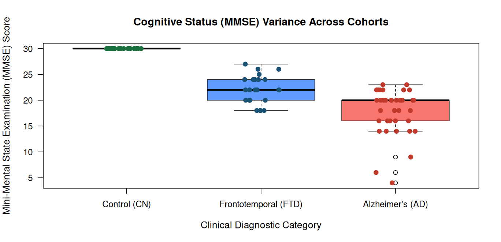

# OpenNeuro Clinical Data Analysis: Alzheimer's Dataset

This repository features data cleaning and visualization pipelines for open-source clinical neuroscience data sourced from OpenNeuro.

### Project Assets
* **Analysis Script**: `clean_data.m` (Custom MATLAB pipeline for data extraction and sorting).
* **Cleaned Dataset**: `cleaned_alzheimers_data.csv` (Processed behavioral and MMSE clinical metrics).
* **Data Visualization**: See the plot below representing the clinical trends.

### Methodology
1. **Extraction**: Loaded raw clinical participant files (`participants.txt`) from public OpenNeuro Alzheimer's cohorts.
2. **Data Wrangling**: Programmed a data pipeline in MATLAB to handle missing variables (`rmmissing`), filtering data arrays by Group and MMSE scores.
3. **Statistical Summary**: Calculated unique clinical categorization blocks for profiling trends.
4. **Visualization**: Plotted behavioral distributions and summary matrices using R.

### Analysis Visualizations

